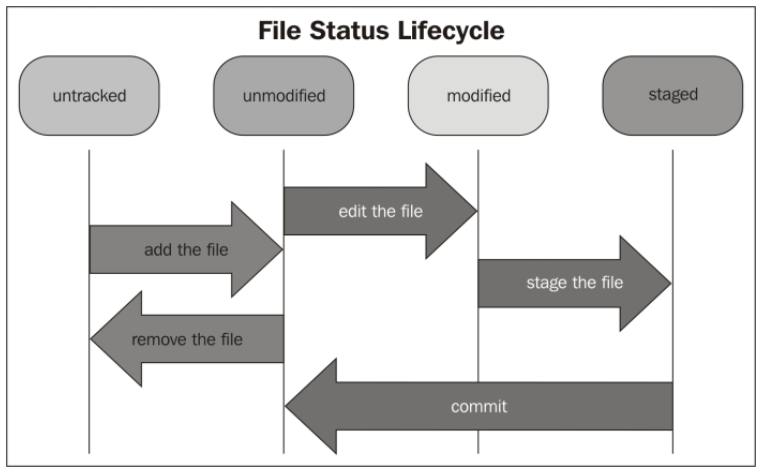

## Setting up new repository

```shell
$ mkdir learngit
$ cd learngit
learngit$ git init 

learngit$ ls -la .git/
total 40
drwxrwxr-x 7 tan tan 4096 Jun  8 10:45 .
drwxrwxr-x 3 tan tan 4096 Jun  8 10:31 ..
drwxrwxr-x 2 tan tan 4096 Jun  8 10:31 branches
-rw-rw-r-- 1 tan tan   92 Jun  8 10:31 config
-rw-rw-r-- 1 tan tan   73 Jun  8 10:31 description
-rw-rw-r-- 1 tan tan   23 Jun  8 10:31 HEAD
drwxrwxr-x 2 tan tan 4096 Jun  8 10:31 hooks
drwxrwxr-x 2 tan tan 4096 Jun  8 10:31 info
drwxrwxr-x 4 tan tan 4096 Jun  8 10:31 objects
drwxrwxr-x 4 tan tan 4096 Jun  8 10:31 refs
```

## File status life cycle

```shell
desiredcloud/learngit$ touch newfile.txt
desiredcloud/learngit$ git status
On branch master
Untracked files:
  (use "git add <file>..." to include in what will be committed)
        newfile.txt

nothing added to commit but untracked files present (use "git add" to track)
desiredcloud/learngit$ git add newfile.txt 
desiredcloud/learngit$ git status
On branch master
Changes to be committed:
  (use "git restore --staged <file>..." to unstage)
        new file:   newfile.txt

desiredcloud/learngit$ echo "hello" > newfile.txt 
desiredcloud/learngit$ git status
On branch master
Changes to be committed:
  (use "git restore --staged <file>..." to unstage)
        new file:   newfile.txt

Changes not staged for commit:
  (use "git add <file>..." to update what will be committed)
  (use "git restore <file>..." to discard changes in working directory)
        modified:   newfile.txt

desiredcloud/learngit$ git add newfile.txt 
desiredcloud/learngit$ git status
On branch master
Changes to be committed:
  (use "git restore --staged <file>..." to unstage)
        new file:   newfile.txt

desiredcloud/learngit$ git commit
[master 1ff47d2] added another file - newfile.txt
 1 file changed, 1 insertion(+)
 create mode 100644 newfile.txt
desiredcloud/learngit$ git status
On branch master
nothing to commit, working tree clean
desiredcloud/learngit$ echo "hello again" > newfile.txt 
desiredcloud/learngit$ git status
On branch master
Changes not staged for commit:
  (use "git add <file>..." to update what will be committed)
  (use "git restore <file>..." to discard changes in working directory)
        modified:   newfile.txt

no changes added to commit (use "git add" and/or "git commit -a")
desiredcloud/learngit$ git add newfile.txt 
desiredcloud/learngit$ git status
On branch master
Changes to be committed:
  (use "git restore --staged <file>..." to unstage)
        modified:   newfile.txt

desiredcloud/learngit$ git commit -m "added newfile"
[master b96ce32] added newfile
 1 file changed, 1 insertion(+), 1 deletion(-)
desiredcloud/learngit$ git status
On branch master
nothing to commit, working tree clean
desiredcloud/learngit$ git log HEAD
commit b96ce32783bd46d6be12f5aab2676803f0f8ae37 (HEAD -> master)
Author: Tanveer Alam <tan24alam11@gmail.com>
Date:   Sat Jun 8 18:49:07 2024 +0530

    added newfile

commit 1ff47d2e5ec9fcc39cd234882294e06c20ded570
Author: Tanveer Alam <tan24alam11@gmail.com>
Date:   Sat Jun 8 14:33:59 2024 +0530

    added another file - newfile.txt

commit c3f1349fe7c426efe52f34c72848be887d4b8b07
Author: Tanveer Alam <tan24alam11@gmail.com>
Date:   Sat Jun 8 11:58:11 2024 +0530

    2nd commit using git commit command

commit 85c1969d53e9b49aeea144170340b8d33d5fbb95
Author: Tanveer Alam <tan24alam11@gmail.com>
Date:   Sat Jun 8 11:42:31 2024 +0530

    first commit

```

---



- When you create or copy a new file in the working directory, the first state of the file is untracked. 
- This means that Git sees that there is something new, but it won't take care of it (it would not track the new file). 
- If you want to include the file in your repository, you have to add it using the add command. 
- Once it is added, the state of the file becomes unmodified. 
- It means that the file is new (Git says it is unmodified because it never tracked changes earlier) and ready to be committed, or it has reached the staging area (also called index). 
- If you modify a file that is already added to the index, it changes its status to modified


## Unstaging a file

-> HEAD points to the current branch name

```shell
/desiredcloud/learngit$ touch 3.txt
desiredcloud/learngit$ gs
On branch master
Untracked files:
  (use "git add <file>..." to include in what will be committed)
        3.txt

nothing added to commit but untracked files present (use "git add" to track)
desiredcloud/learngit$ ga .
desiredcloud/learngit$ gs
On branch master
Changes to be committed:
  (use "git restore --staged <file>..." to unstage)
        new file:   3.txt

desiredcloud/learngit$ git reset HEAD 3.txt
desiredcloud/learngit$ gs
On branch master
Untracked files:
  (use "git add <file>..." to include in what will be committed)
        3.txt

nothing added to commit but untracked files present (use "git add" to track)
```

### git restore --stage <file>

```shell
git restore --stage 3.txt
```

### Another option - git rm --cached

```shell
desiredcloud/learngit$ gs
On branch master
Changes to be committed:
  (use "git restore --staged <file>..." to unstage)
        new file:   3.txt

desiredcloud/learngit$ git rm --cached 3.txt 
rm '3.txt'
desiredcloud/learngit$ gs
On branch master
Untracked files:
  (use "git add <file>..." to include in what will be committed)
        3.txt

nothing added to commit but untracked files present (use "git add" to track)
```

-> This option simply removes it from the index, but not from the filesystem. However, remember that git rm is to remove files from the index. So, if you use the git rm command on an already committed file, you actually mark it for deletion


## HEAD


- At the end, once you commit, the present becomes part of the past. 
- The working directory comes back to the initial state, where all is untouched and the index is emptied.


## History

- `git log`
- `git log --graph`
- `git log --pretty=online`
- `$git log --graph --decorate --pretty=oneline --abbrev-commit`

## Gitignore

- `git add -f` to add file even if its marked ignored in .gitignore

## Tag a commit

- `git tag -a TagName -m "message"`

## Git Alias